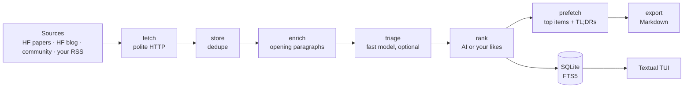

# augury

**A terminal-native AI research digest.** Every day augury gathers new AI papers and posts, ranks them for you, and lets you read the full text without leaving the terminal.


> **Status: pre-alpha.** v0.1 is in development, and there's no release on PyPI yet.
> It runs on macOS and Linux and needs Python 3.14, which `uv` installs for you. Apache-2.0.

## Why

There are too many papers and posts, spread over too many sites. Reading them means a browser full of tabs. augury puts them in one fast, keyboard-driven view: it tells you why each item might be worth your time, remembers what you like, and renders whole papers right in the terminal.

## What it does

- **Collects** Hugging Face trending papers, the Hugging Face blog, HF community posts, and any blog with an RSS/Atom feed you add (`augury sources add jvns.ca`).
- **Reads in the terminal:**
  - full arXiv papers, with math shown as Unicode, from arXiv's HTML version or the PDF;
  - blog posts, cleaned up by per-site extractors;
  - a table of contents, zen mode, reading progress, vim keys, and live full-text search.
- **Ranks what matters to you, with or without AI:**
  - *Without an API key:* augury ranks by **your own ★ likes**. It runs a "more like what I liked" search over your liked items, weighs the sources you like and how recent each item is, and explains every score ("matches your likes: diffusion, RL · source you like · 2h ago").
  - *With a key:* a fast model **triages** each new item. It gives a 0–10 relevance score, a one-line "why read", tags, and promo/thin flags. It also writes a **TL;DR with takeaways** when you open an item.
- **Stays cheap and safe:**
  - a daily budget, checked *before* each model call;
  - fetched text passed to the model as data, never as instructions;
  - roughly $0.003 to triage 14 posts with the default model.
- **Is polite to the sites it reads:**
  - it respects robots.txt and each site's Crawl-delay;
  - it makes one request per second per site;
  - it uses an honest User-Agent and conditional GETs.
- **Exports** each day's digest as portable Markdown, for any notes app.
- **Is model-agnostic:** Gemini is the default, through Google ADK. Any other provider works through LiteLLM.

## Quick start

augury isn't on PyPI yet, so install it from a clone with [uv](https://docs.astral.sh/uv/):

```bash
git clone https://github.com/omarcevi/augury.git
cd augury
uv tool install .              # add '.[providers]' for non-Gemini models (LiteLLM)

augury init                    # your interests, sources, export folder, AI key (all optional)
augury doctor                  # checks paths, config, database, models and network
augury scout                   # fetch today's papers and posts
augury                         # read them. Press ? for every key
```

To run it without installing, use `uv run augury …` inside the clone.

**Optional: turn on AI.** Get a Gemini API key from [Google AI Studio](https://aistudio.google.com/apikey) and paste it when `augury init` asks. augury saves it to a private `.env` file (mode 600) and never shows it again. Everything else works without a key.

**Optional: scout every morning.** `augury schedule install --time 07:00` sets up launchd on macOS or a systemd timer on Linux. On other systems it prints a cron line for you to add.

## A quick tour

| | |
|---|---|
|  |  |
| **Reader:** the TL;DR and takeaways sit above the article. `h` collapses them, `z` is zen mode, `c` shows the contents. | **Settings (`3`):** edit any setting in place, or reset it to its default. Changes are saved to `config.toml` with your comments kept. |

The essentials: `↑/↓` move, `Enter` read, `/` search, `l` like, `b` save, `x` hide, `s` sort, `v` show, `#` tags, `r` scout now, `t` theme, `?` help.

**➡️ The full [user guide](docs/guide.md)** covers every key, how ranking works, AI setup, sources, every setting, and where your data lives.

## How it works



- **One scout, one workflow.** The steps above are nodes of a single [Google ADK](https://google.github.io/adk-docs/) graph workflow. Each step is isolated, so a failing AI step never loses the items a scout already stored.
- **Everything lives in one SQLite file** (WAL mode, FTS5 search, numbered migrations). You can open it with any SQLite client.
- **The TUI never fetches on cursor movement.** The preview shows only cached text. Articles are fetched when you open them, or ahead of time for the top of the digest.

## Roadmap

v0.1 is built in milestones:

- ✅ **M1: the reader.** Sources, polite fetching, full-text reading, search, the TUI.
- ✅ **M2: the ranked digest.** Triage, ranking (AI or likes), TL;DRs, budget, doctor, export, editable settings.
- ⏳ **M3: the discovery agent.** Add any site by URL *or by name* ("google tech blogs"). An agent finds a way to fetch it (RSS, sitemap, or an HTML listing) and saves a recipe only after it passes a real test.
- ⏳ **M4: RAG.** Hybrid search (FTS5 + vectors), "also covered by" clusters, related items, and asking questions about your digest with checked citations.

Later, v0.2 is "Studio": drafting posts and newsletters in your own voice from what you've read.

## Development

```bash
uv sync --all-extras
uv run pytest                    # ~880 tests, fully offline: no network, no API keys
uv run pytest -m live            # opt-in live model checks (needs a key in the environment)
uv run ruff check && uv run ruff format --check && uv run pyright
uv run python scripts/screenshots.py   # regenerate docs/images/*.svg
```

The TUI has SVG snapshot tests. Run `uv run pytest --snapshot-update` to refresh the baselines after an intended UI change.

For a scratch install that leaves your real data alone, set `AUGURY_HOME=/tmp/augury-dev` before running any command.

## License

[Apache-2.0](LICENSE)
