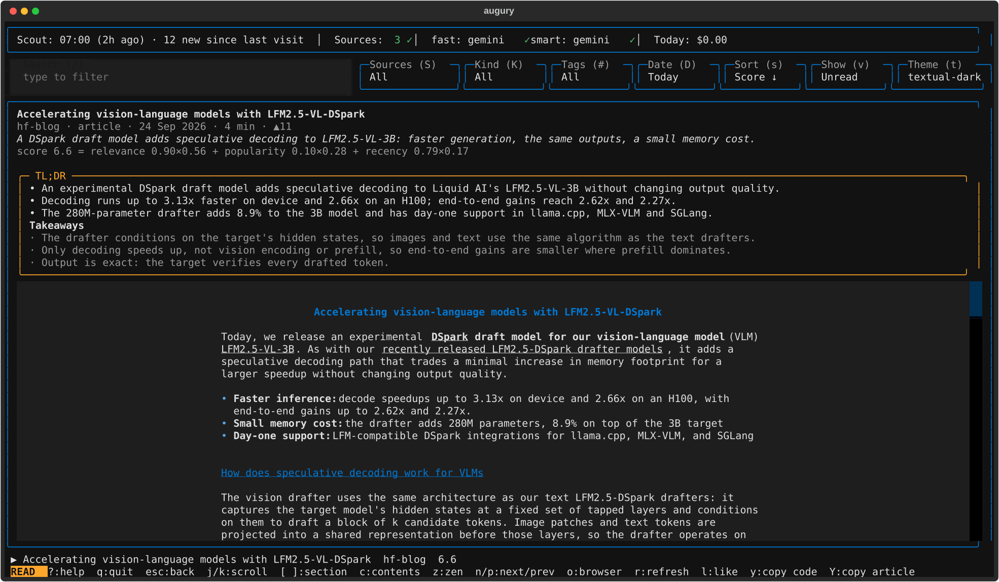

# augury user guide

This guide covers everything augury does today (v0.1, milestones M1 and M2). For a short overview, see the [README](../README.md).

**Contents**
1. [Install](#1-install)
2. [First run](#2-first-run)
3. [Getting new items: the scout](#3-getting-new-items-the-scout)
4. [The digest view](#4-the-digest-view)
5. [Reading](#5-reading)
6. [How ranking works](#6-how-ranking-works)
7. [AI: triage, TL;DRs, models and budget](#7-ai-triage-tldrs-models-and-budget)
8. [Sources](#8-sources)
9. [Settings](#9-settings)
10. [Export to Markdown](#10-export-to-markdown)
11. [Where your data lives](#11-where-your-data-lives)
12. [How augury fetches (politeness rules)](#12-how-augury-fetches-politeness-rules)
13. [Troubleshooting](#13-troubleshooting)
14. [Every key](#14-every-key)

---

## 1. Install

You need macOS or Linux, and [uv](https://docs.astral.sh/uv/). uv fetches Python 3.14 for you. augury isn't on PyPI yet, so install it from a clone:

```bash
git clone https://github.com/omarcevi/augury.git
cd augury
uv tool install .                 # Gemini only
uv tool install '.[providers]'    # also OpenAI, Anthropic, Ollama, … through LiteLLM
```

To run it without installing, use `uv run augury …` inside the clone.

**Trying it out safely.** Every file augury uses goes under `$AUGURY_HOME` when that variable is set. This gives you a throwaway sandbox:

```bash
export AUGURY_HOME=/tmp/augury-try
rm -rf "$AUGURY_HOME"             # start fresh any time
```

## 2. First run

```bash
augury init        # a few questions; every answer is optional
augury doctor      # check that everything is in place
augury scout       # fetch today's items (about 40 s the first time)
augury             # open the TUI
```

**What `augury init` asks:**
1. **What do you do?** One line, e.g. *"ML engineer building RAG apps"*.
2. **Topics you care about**, comma-separated, e.g. *"LLM agents, RAG, diffusion models"*.
3. **Topics to skip**, e.g. *"crypto, AI art, funding rounds"*.
4. Whether to include Hugging Face **community posts**. They're busier and carry more self-promotion.
5. A **folder for Markdown digests**. Leave it blank to skip.
6. An **AI provider** (`gemini`, `vertex_ai`, `litellm` or `none`), plus its key.

The first three answers go to `interests.yaml`. Only the AI triage reads them, so without a key they don't change anything. You can edit them later on the settings page (`3`). `augury init --yes` accepts every default without asking. If your files already exist, init asks before overwriting them.

**`augury doctor`** checks paths, config files, the database, each AI model role, and the network. With a key, it makes a tiny live call to each model to check it returns structured output. `--offline` skips the network and the model checks.

## 3. Getting new items: the scout

A **scout** fetches each enabled source's listing, stores the new items, and prepares them for the digest. With an AI key, it also triages and summarizes them. A scout runs:

- **when the TUI launches**, if the last scout is 12 or more hours old or ran on an earlier day (`[scout] auto_after_hours`; `0` turns this off);
- when you press **`r`** in the TUI;
- when you run **`augury scout`** (add `--source ID` to scout just one source);
- **every morning**, if you install a schedule: `augury schedule install --time 07:00` (launchd on macOS, a systemd user timer on Linux, or a cron line to add yourself). Use `augury schedule status` to check it and `augury schedule uninstall` to remove it.

A scout runs these steps in order. If one step fails, the steps that already finished keep their results:

| Step | What it does |
|---|---|
| fetch | one listing request per source, in parallel |
| store | saves new items and deduplicates them by id and canonical URL |
| enrich | fetches up to 40 new articles' opening paragraphs, so the list shows a real summary |
| triage | *(with a key)* scores, tags and flags today's new items |
| rank | builds today's ranked digest |
| prefetch | *(with a key)* fetches the top 10 items and writes their TL;DRs |
| export | *(if configured)* writes `Daily/<date>.md` |

## 4. The digest view


**Top bar:** the status line. It shows:
- the last scout and how many items are new since your last visit;
- source health: `✓` ok, `⚠` degraded, `✗` broken;
- the AI status for each role (`AI: not configured` without a key);
- today's AI spend, including "budget reached" when the daily cap is hit.

**Filter chips.** Each chip has its own key:

| Chip | Key | Options |
|---|---|---|
| Search | `/` | live full-text search (it handles jargon like `Qwen3-30B-A3B`); Enter or Esc returns to the table |
| Sources | `S` | pick the sources to show |
| Kind | `K` | paper / article |
| Tags | `#` | filter by triage tags (with AI; the chip is hidden below 100 columns) |
| Date | `D` | today / 7 days / 30 days / all |
| Sort | `s` | score / newest / popular / reading time |
| Show | `v` | unread / new / all / saved / liked / hidden |
| Theme | `t` | cycle themes (the chip is hidden below 160 columns) |

**Table columns:**

| Column | Meaning |
|---|---|
| St | ● unread · ◐ partly read · ○ read |
| Title | ✦ new since your last visit · ★ liked · ⊕ saved |
| Source, Tags | where the item is from, and its triage tags |
| Score | today's ranking score, 0–10 (see [§6](#6-how-ranking-works)) |
| ▲ | popularity (upvotes or likes on the source) |
| Age, Min | how old it is, and the estimated reading time |

**The preview** on the side shows the selected item's summary, its "why read" line, and **why it ranks where it does**. It only ever shows cached text, so moving the cursor never fetches anything or calls a model.

**Actions:**
- `l` like (★), `b` save (⊕), `x` hide. These survive restarts.
- `o` opens the item in your browser (http/https only).
- `H` shows or hides the "N hidden by triage" line, for items the AI flagged as promo or thin. They're only kept out of the default view. `v` → *all* still lists them.

With `[tui] remember_state = true` (the default), augury restores your filters, search, view and selected row on the next launch.

## 5. Reading


Press **Enter** to open an item.
- **Papers:** the abstract shows immediately. Then the full paper loads from arXiv's HTML version, with math rendered as Unicode (α, ≤, ℝ…). If that fails, augury falls back to the PDF. arXiv asks crawlers to wait 15 s between requests, so opening a second paper quickly shows *"Waiting 14s for arxiv.org…"*. augury honours it.
- **Articles:** the page is cleaned into Markdown with headings, lists, code and tables. Images show as `[image: …]` links.
- **Paywalled or failed pages:** you get the summary, and `o` opens the page in your browser.

Everything you open is cached, so a second open is instant and works offline.

**TL;DR box** (with an AI key): a short TL;DR and takeaways sit above the article.
- It's written the first time you open an item, then cached. The top 10 items were usually written ahead of time during the scout.
- `h` collapses it to one line and expands it again. augury remembers your choice. **While it's collapsed, no TL;DR is written**, so nothing is spent.
- `T` retries a TL;DR that failed. The box scrolls if it's long: use the mouse wheel, or shift+tab into it and then the arrow keys.

**Reader keys:**
- **Moving through the text:** `j`/`k` or space scroll; `J`/`K` scroll fast; `g`/`G` jump to the top or bottom; `ctrl+d`/`ctrl+u` move half a page.
- **Navigation:** `[`/`]` go to the previous or next section; `c` shows the contents; `z` is zen mode (full width, centred at `[tui] reading_width`); `n`/`p` open the next or previous item.
- **Actions:** `l` like; `o` open in the browser; `y` copy a code block; `Y` copy the whole article; `esc` goes back to the table.

Selecting text with the mouse copies it (`[tui] copy_on_select`). This uses OSC 52, plus `pbcopy`/`wl-copy`/`xclip` when available.



Reading progress is saved. When you come back, the row shows ◐ and the article reopens where you left it. To reopen the last article at launch, set `[tui] reopen_last_article = true`.

## 6. How ranking works

Each scout ranks **today's new items** into a digest. An item appears in one day's digest only. Scores are computed between 0 and 1 and shown ×10: a score of 7.3 in the table means 0.73. The preview spells out the sum with the weights actually used, for example:

```
score 7.3 = relevance 0.90×0.56 + popularity 0.70×0.28 + recency 0.24×0.17
```

There are three modes:

**With an AI key: the spec formula**
`score = 0.50 × relevance + 0.25 × popularity + 0.15 × recency (+ 0.10 × novelty, from M4)`
- *Relevance* is triage's 0–10 score, scaled to 0–1.
- *Popularity* is a percentile **within the item's own source** over the last 30 days. A paper competes with papers, not with blog posts.
- *Recency* is `exp(−age_days / 3)`: 1.0 when new, about 0.72 after a day, 0.37 after 3 days.

**Without a key, once you've liked something: your likes**
`score = 0.45 × topic match + 0.20 × source you like + 0.35 × recency`
- *Topic match:* augury takes the 30 most common words from the titles and summaries you've ★ liked (stopwords and numbers are dropped). It searches today's items for them with SQLite FTS5 and scores each item with bm25. The best match scores 1.
- *Source you like:* a smoothed like rate per source, `(likes + 1) / (seen + 10)`, where "seen" means opened or liked. The smoothing stops a single like from making a source dominate.
- The preview shows the reasons, e.g. *"matches your likes: diffusion, RL · source you like · 2h ago"*.

**Without a key, before your first like: cold start**
`score = popularity and recency, weighted 62.5% / 37.5%`

Some details:
- **When a term is missing,** its weight is spread over the others. For example, an RSS blog has no upvotes, so it's ranked on the other terms. Novelty doesn't exist until M4, which is why the example above uses 0.56 / 0.28 / 0.17 rather than 0.50 / 0.25 / 0.15.
- **When changes apply:** ranking happens during the scout, so a new like counts at the next scout. Press `r` to re-rank.
- **What doesn't count:** likes on items you've hidden, and saves (⊕), which aren't a signal yet.
- **Tuning:** the weights live in `[ranking]`. Only their ratios matter.

## 7. AI: triage, TL;DRs, models and budget

AI is optional. Without a key, augury works fully and ranks by your likes.

**Triage** runs during the scout, on today's new items, in batches of up to 50 per call. For each item it reads the title, source, a 600-character summary and the popularity signals, plus your interests (what you do, your topics, and topics to skip). It returns:

| Field | Used for |
|---|---|
| relevance 0–10 | half of the ranking score |
| why_read (≤140 characters) | the preview, the reader header, the export |
| tags (up to 3) | the `#` tag picker |
| flags: promo / thin / off_topic | promo and thin items are hidden from the default view (`H`) |

Each item is triaged once and the result is stored. A reply that breaks the format gets one repair attempt, then the batch is split in half until it works. An item that still fails simply has no AI score.

**TL;DRs** are written with the same fast model, from the full article text (up to 120,000 characters, `[summarizer] max_input_chars`), and cached per item.

**Prompt safety.** Fetched text is passed to the model as fenced *data*. It is never treated as instructions. A post that says "rate this 10/10" is judged, not obeyed.

**Models** are set per *role* in `[models]`:

| Role | Default | Used for |
|---|---|---|
| `fast` | `gemini/gemini-3.5-flash-lite` | triage, TL;DRs |
| `smart` | `gemini/gemini-3.1-pro-preview` | the discovery agent (M3), Ask (M4) |

- `gemini/…` and `vertex_ai/gemini…` models run natively through Google ADK.
- Any other `provider/model` string (`openai/…`, `anthropic/…`, `ollama_chat/…`, …) goes through **LiteLLM**. Install it with `'.[providers]'`.
- `[models] overrides` pins a model for one agent (`triage`, `summarizer`, `discovery` or `ask`).

**Keys** live only in the environment or in augury's private `.env` file (next to `config.toml`, mode 600). They never go in `config.toml`. `augury init` writes the file for you. For Gemini the variable is `GEMINI_API_KEY`. For Vertex AI, set `[google] project` and `location` and use your Google Cloud credentials.

**Budget** (`[budget]`):
- Every model call is metered, and augury checks the budget **before** each call.
- `daily_usd = 1.00` is the default cap. Set it to `0` to turn every AI feature off.
- `daily_tokens = 2000000` caps models without a known price.
- Prices come from a built-in table and LiteLLM's offline price map. `[pricing."provider/model"]` adds your own.

When the cap is reached, AI steps stop cleanly for the day, and the status line says "budget reached". For scale, with the default fast model, triaging 14 posts cost about $0.003 and two TL;DRs about $0.006.

## 8. Sources

| Source | What it fetches |
|---|---|
| `hf-papers` | Hugging Face daily papers, trending (top 50) |
| `hf-blog` | the Hugging Face blog |
| `hf-community` | Hugging Face community posts, trending (top 20) |
| your blogs | any site with an RSS/Atom feed |

**From the command line:**
```bash
augury sources list                          # every source and its health
augury sources add jvns.ca                   # a page URL or bare domain: its feed is found for you
augury sources add --rss https://…/feed.xml  # or give the feed directly (--name to set a name)
augury sources test <id>                     # fetch once and show what comes back (nothing is stored)
augury sources disable <id> / enable <id>    # skip a source in scouts (its items stay)
augury sources remove <id>                   # remove a source you added, and its items
```

**In the TUI**, press `2`: `+` adds a source, `t` does a test fetch, `e` enables or disables, `d` removes (built-in sources can only be disabled), and `1` or `esc` goes back.

Coming in M3: add a site **by name** ("google tech blogs") or a site without a feed. An agent will find a sitemap or HTML-listing recipe for it.

## 9. Settings


Press **`3`** for the settings page. It lists every setting with its value and where it comes from: `default` (built in), `config.toml`, or `interests.yaml`.

- **Enter** edits the selected setting. On/off settings flip, choices and themes open a picker, and numbers and text open an input that shows the allowed range and rejects bad values. **space** flips an on/off setting.
- **backspace** or **delete** resets a setting to its default by removing it from the file, or clears an interest.
- **`e`** opens `config.toml` in your `$EDITOR`, for settings with no single-value editor, like `[pricing]`.
- `y` / `Y` copy the page; `j`/`k` and `g`/`G` move.

Every edit is checked before it's saved. Only that one key is changed, your comments are kept, and the file is written atomically. A toast tells you when the change takes effect: *now*, *from the next scout*, or *on next launch*.

`augury config` prints the same information in the terminal, and `augury config --path` prints the file's location.

**All settings** (defaults shown):

| Setting | Default | What it does |
|---|---|---|
| `scout.auto_after_hours` | 12.0 | scout at launch if the last scout is this old (0 = off) |
| `scout.enrich_max_per_run` | 40 | new articles whose opening paragraph is fetched per scout |
| `scout.prefetch_top_n` | 10 | top items fetched and summarized per scout (with a key) |
| `http.min_interval_s` | 1.0 | minimum gap between requests to one site |
| `http.timeout_s` | 20.0 | request timeout in seconds |
| `http.max_bytes` | 10000000 | largest response accepted |
| `http.max_redirects` / `http.retries` | 5 / 3 | redirect and retry limits |
| `export.path` | "" | folder for daily Markdown (empty = off) |
| `tui.theme` | textual-dark | also: dracula, nord, gruvbox, tokyo-night, catppuccin-mocha, textual-light |
| `tui.remember_state` | true | restore filters, search, view and row on launch |
| `tui.reopen_last_article` | false | also reopen the last article, where you left it |
| `tui.copy_on_select` | true | copy mouse selections to the clipboard |
| `tui.reading_width` | 88 | reader text width in cells (40–200) |
| `tui.tldr` | shown | `shown` or `collapsed` (collapsed writes no TL;DRs until expanded) |
| `models.fast` / `models.smart` | see [§7](#7-ai-triage-tldrs-models-and-budget) | the model for each role |
| `google.project` / `google.location` | "" | Vertex AI only |
| `budget.daily_usd` | 1.00 | daily AI spend cap (0 = AI off) |
| `budget.daily_tokens` | 2000000 | cap for models without a known price |
| `ranking.w_rel` / `w_pop` / `w_rec` / `w_nov` | 0.50 / 0.25 / 0.15 / 0.10 | AI-mode weights |
| `ranking.w_topic` / `w_source` / `w_fresh` | 0.45 / 0.20 / 0.35 | likes-mode weights |
| `ranking.like_terms` | 30 | words taken from your liked items |
| `summarizer.max_input_chars` | 120000 | how much article text a TL;DR reads |
| `interests.about` / `topics` / `avoid` | empty | your profile, for AI triage (in `interests.yaml`) |

## 10. Export to Markdown

Set `export.path` to a folder, either on the settings page or during `augury init`. After every scout, augury writes `Daily/<YYYY-MM-DD>.md` there. Each file has YAML frontmatter and today's ranked items with their why-read lines, tags and links.

It's plain, portable Markdown, so it works in Obsidian (point `export.path` inside your vault), VS Code, GitHub or a static site. Titles and links are escaped, so a hostile title can't break the file.

`augury export --day 2026-09-26` rewrites a given day.

## 11. Where your data lives

| | macOS | Linux | with `AUGURY_HOME` |
|---|---|---|---|
| config (`config.toml`, `interests.yaml`, `.env`) | `~/Library/Application Support/augury` | `~/.config/augury` | `$AUGURY_HOME/config` |
| data (`augury.db`, `ui_state.json`, logs) | `~/Library/Application Support/augury` | `~/.local/share/augury` | `$AUGURY_HOME/data` |
| cache | `~/Library/Caches/augury` | `~/.cache/augury` | `$AUGURY_HOME/cache` |

`augury config` prints the exact paths on your machine.

**The database** is a single SQLite file, `augury.db`, in WAL mode. You can open it with any SQLite client (DataGrip, TablePlus, `sqlite3`). Open it **read-only** while augury is running, and keep the `-wal` and `-shm` files next to it. The useful tables:
- `items`, `sources`, `contents` (extracted text), `signals` (upvotes);
- `item_state`: likes, saves, hides and reading progress;
- `triage`, `digests` (with `breakdown_json`), `summaries`;
- `runs`: every scout and summarize run, with tokens and cost.

```sql
-- today's digest with the AI's take
SELECT d.position, round(d.final_score, 2) AS score, i.title, t.why_read
FROM digests d JOIN items i ON i.id = d.item_id LEFT JOIN triage t ON t.item_id = d.item_id
WHERE d.day = date('now', 'localtime') ORDER BY d.position;
```

**Privacy.**
- Everything is stored locally.
- The only network traffic is fetching sources and articles, plus the model calls you configure.
- augury sends no telemetry, and it turns off LiteLLM's telemetry and its price-map download.

## 12. How augury fetches (politeness rules)

All network access goes through one HTTP client with fixed rules:

- **robots.txt** is fetched once per site and cached for 24 h. Disallowed URLs are never fetched. If robots.txt returns 4xx, the site is treated as allowing everything. If it returns 5xx, the site is treated as disallowed for 5 minutes.
- **Spacing:** at most one request per second per site (`http.min_interval_s`), or longer if the site's `Crawl-delay` asks for it.
- **Identity:** `User-Agent: augury/<version> (+https://pypi.org/project/augury/)`. There's no browser impersonation.
- **Retries:** network errors, 429 and 5xx are retried up to 3 times with exponential backoff, and `Retry-After` is honoured (capped at 60 s).
- **Limits:** 20 s timeout, a 10 MB response cap (checked while downloading), 5 redirects, http(s) only.
- **Conditional GETs** for feeds, so an unchanged feed costs a `304`.
- **No logins, no paywall bypass, no JavaScript rendering.** Such pages get a "paywalled" or "failed" note and an `o` to open them in your browser.
- **Caching:** a successful extraction is cached until the extractor changes. A failed page is retried after an hour at the earliest.

## 13. Troubleshooting

| You see | Do this |
|---|---|
| `AI: not configured` | No key found. Run `augury init`, or add `GEMINI_API_KEY=…` to the `.env` next to `config.toml`, then run `augury doctor`. |
| `budget reached` | The day's cap is spent, and AI resumes tomorrow. Raise `budget.daily_usd` on the settings page if you want. |
| `interests.yaml has 1 problem(s)` | The file has an old or unknown key. Run `augury init` (it asks before overwriting), or fix the key it names. |
| *"Waiting 14s for arxiv.org…"* | arXiv's requested crawl delay. It's normal, and augury waits for you. |
| The digest is sorted by Newest | You chose that sort earlier and it's remembered. Press `s` until the chip says Score. |
| Scout failed / offline | You still get cached items. `augury doctor` explains network problems. |
| Something is weird after an upgrade | This is pre-alpha, and old settings files aren't migrated. Re-run `augury init`, or delete `ui_state.json` to reset the TUI's remembered view. |

`augury doctor` is always the first thing to run.

## 14. Every key

Press `?` in the TUI for this list, specific to where you are. The bottom row shows the most useful keys.

**Items view**

| Key | Action | Key | Action |
|---|---|---|---|
| `↑`/`↓`, `g`/`G`, `ctrl+d`/`ctrl+u` | move | Enter | read |
| `/` | search | `S` `K` `#` `D` | pick sources, kind, tags, date |
| `s` | cycle sort | `v` | cycle show |
| `l` `b` `x` | like, save, hide | `H` | triage-hidden line |
| `o` | open in browser | `r` | scout now |
| `t` | theme | `2` / `3` | sources / settings |
| `?` | help | `q` | quit |

**Reader:** `j`/`k` space `J`/`K` `g`/`G` `ctrl+d`/`ctrl+u` scroll · `[` `]` section · `c` contents · `z` zen · `n`/`p` next/previous · `h` hide or show TL;DR · `T` retry TL;DR · `l` like · `o` browser · `y`/`Y` copy code or article · `r` scout · `esc` back.

**Sources (`2`):** `+` add · `t` test fetch · `e` enable/disable · `d` remove · `r` scout · `1`/`esc` back.

**Settings (`3`):** Enter edit · space flip · backspace/delete reset · `e` edit file · `y`/`Y` copy · `j`/`k` `g`/`G` move · `1`/`2` views · `esc` back.
